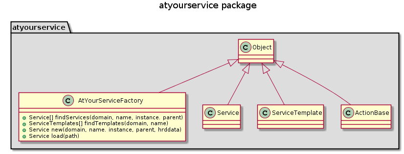

# AtYourService - @YS

## Goals
### Deployment system :
- easy installation
- full live cycle monitoring of an application
    + build
    + install
    + reset
    + start
    + stop
    + restart
    + monitor
    + import data
    + export data
- possibility to install on **remote machines.**

### Modeling system :
#### concepts :
@ys can be used to models an full environment, from the more general  (location, data-center) to the most specific (port-forward on a switch) component.

The modeling if done trough **2 files** :
- An **HRD file** that contains the metadata and describe the service/component 
- a **python file** that contains the business logic of every action possible for the service/component.
- A service is identified by it's domain, name, instance and parent
- all files are located inside a directory names ```domain__name__instance```
    example : for a mongo service we could have ```jumpscale__mongodb__main```

#### Environment management :
The modeling and management of a environment will used the remote installation feature.  
The idea is that we have all services that models the environment inside a git repo on a 'master' machine. This machine is used to manage the all environment and git is used to have version of the model.

Just a look at the services on the 'master' machine will give us a full view of the status of the environment. Then it's vital to keep the local services synced with the actual instance of them remotely

#### Relations between services
##### Parent/childs
- A service is the parent of other services.
- All child services are located inside the directory of the parent.
```
parent
 |
 | - child1
     | action.py
     | service.hrd
 | - child2
     | action.py
     | service.hrd
 | action.py
 | service.hrd
```
- A service is also identified by it's parent, so two services with the same domain/name/instance can exits if they have different parents.

##### Producer/Consumer
if an @ys package can provide a service to another @ys package, it's called a producer.
To use these producer, one needs a consumer, so @ys package can also be a consumer.

A service can be producer and consumer at the same time. this allows chaining of services that work all together.

Two producer of the same type, can be replace one by another seamlessly.
(?? need to define an interface for a type of producer ??)

###### Example
This concepts is used  to enable the remote installation of services.
Here is an concrete example :
We want to install a mongodb server on a remote machine.  
What do we need ? :
- a mongodb service.
- a service that describe the remote machine and provide a way to comminucate with it, let's call it a node service

the **mongodb** service will be the **consumer** and   
the **node** service will be the **producer**

mongodb service by consuming the node service allow tell @ys that during installation, the node service will be use as the target for the installation.

###### More than just remote installation
The concept of producer/consumer can be applied to lot's of different use case.  
On can think of a service that produce data, like statsd. statsd need to save its data somewhere. It can use a producer 'database' to save its data.
And What really nice about this, is that any producer database can be used to save the data. statsd don't need to be aware of it. It just know that it consume a 'database' producer and that's it.


## Implementation
### Deployment system :

####  Local deployment
- **Build** :
    - look into HRD for source file location and compiler needed to compile.
    - compile the service
    - upload binary to binary repo
- **Installation**:
    Just follow recipe from HRD file to get data and dependencies, then execute code from actions.py file.
    - [diagram install local](diagrams/ays_install_local.png)
- **Reset**:
    + reset remove all trace from a service
    + need to remove service directory and installed files.
    + ?? dependencies management ?? go over dependencies, check if other services require this dependency, if yes keep, if not, remove too.
    + [diagram reset local](diagrams/ays_reset_local.png)

#### Remote deployment
- **Build** :
    - No supported for remote machines
- **Installation**:
    - Need a service that describe the machine where to deploy. Any producer service of **type node** is valid.
    - Initialize all dependencies locally.
        + Retrieve the dependency chain of the service we install.
        + Fill HRD files for all dependencies, but don't download anything on the local machine.
    - send service and dependencies to remote machine.
    - remote machine loads all services in memory and install them locally.
    - [diagram install remote](diagrams/ays_install_remote.png)
- **Reset** :
    + create list of all file/directory to remove
    + send command to remote to reset the service.
    + if no error, reset the service locally too
    + [diagram reset remote](diagrams/ays_reset_remote.png)
- **Start/Stop** :
    + If we try to start/stop a service, means it's installed already, so we just send the start/stop command to the remote node.

## Code Component

